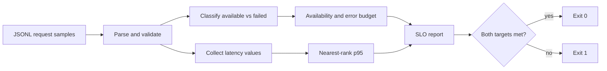

# Service SLO Lab — design notes

## Purpose

Service SLO Lab is a deliberately small example of turning request-level telemetry into a service-level objective (SLO) decision.

The input is a JSON Lines file in which each row contains an HTTP status and a latency measurement. The command-line program validates the samples, calculates availability and p95 latency, converts the availability target into an error budget, and exits non-zero when either target is missed.

The project is intentionally transparent: the calculation lives in a single Python module so every assumption is easy to inspect.

## Data flow



## Input contract

Each line must be valid JSON with:

```json
{"status": 200, "latency_ms": 142.7}
```

Rules enforced by the loader:

- `status` must be convertible to an integer;
- `latency_ms` must be convertible to a number;
- latency cannot be negative;
- an empty input file is rejected;
- the first malformed line stops the run with its line number.

This strict input boundary prevents a partial report from silently hiding malformed telemetry.

## Availability calculation

The lab currently treats HTTP status codes from 200 through 499 as available and everything else as failed:

```text
good = count(200 <= status < 500)
availability = good / total_requests
```

This is a simplification, not a universal SRE definition. A production service may classify timeouts, incorrect responses, selected 4xx responses, or dependency failures differently.

## Error budget

For an availability target `T` over `N` requests:

```text
allowed_failures = floor(N * (1 - T))
error_budget_remaining = allowed_failures - observed_failures
```

A negative remaining budget means the window has exceeded its allowed number of failed requests.

The use of `floor` is intentionally strict. With small sample windows it can make the permitted number of failures drop quickly, which is one reason real SLOs should use meaningful traffic volumes and measurement windows.

## Latency calculation

p95 latency uses the nearest-rank method:

1. sort all latency samples;
2. calculate `ceil(0.95 * N) - 1`;
3. return the value at that zero-based index.

This method is easy to explain and deterministic. It also shows why percentile estimates from tiny datasets are unstable: one request can move the percentile substantially.

## Exit-code behaviour

The CLI prints the complete report as JSON.

It exits with:

- `0` when both availability and latency targets are met;
- `1` when either target is missed.

That makes the script easy to place in a CI job, smoke-test pipeline, or scheduled check without parsing human-readable output first.

## Design choices

### Why JSONL?

JSONL keeps the example stream-friendly and reviewable. Each request is independent, malformed input can be reported by line number, and the format can be produced by many log pipelines.

### Why keep the implementation small?

The goal is to demonstrate the reliability logic rather than hide it behind an observability SDK. A reviewer can inspect validation, availability, percentile, budget, and exit behaviour in one file.

### Why no rolling window?

A rolling window would make the example more realistic but would also require timestamp handling, retention rules, and window semantics. Those are good production extensions rather than prerequisites for the core concept.

## Production extensions

A production version would typically add:

- timestamped events and rolling or calendar windows;
- configurable definitions of a successful request;
- separate SLIs for availability, correctness, and latency;
- multiple latency objectives, for example p95 and p99;
- burn-rate alerts across short and long windows;
- persistent storage rather than one local file;
- labels for route, dependency, region, or service version;
- dashboard integration with Prometheus, Grafana, OpenTelemetry, or a cloud monitoring platform;
- tests around time windows, partial data, delayed events, and very large datasets.

## Interview walkthrough

A concise way to explain the project is:

> The script converts raw request samples into two service-level indicators: availability and p95 latency. It then compares those SLIs with explicit objectives and turns the availability objective into a concrete failure budget. The non-zero exit code demonstrates how the same logic could gate a deployment or scheduled reliability check.

The most important trade-off to mention is that the current HTTP-status rule and small fixed sample window are educational simplifications rather than production-ready SLO policy.
